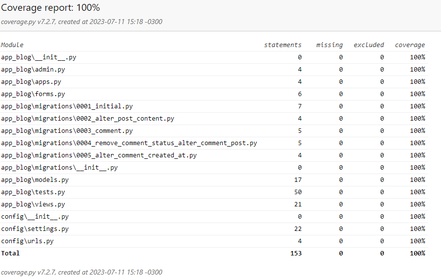

# Desafio Blog com Django

Desenvolver o projeto de um pequeno sistema de blogs usando Python e o framework
Django. Alguns requisitos, premissas e sugestões:

- Não é necessário gastar tempo com detalhes visuais (layout, responsividade, etc). Atentar-se apenas ao básico, usando e implementando jQuery e Bootstrap. O objetivo aqui é validar funcionalidade e código, apenas;
- A nível funcional, controlar apenas os posts do blog, comentários, e quaisquer outras funcionalidades básicas que você julgar necessário;
- Considerar que o Django Admin pode e deve ser utilizado, na medida do razoável. Assim, é tranquilo esperar que o gestor do blog tenha acesso a ele para enviar novos posts mas os leitores, não. Estes precisam enviar seus comentários diretamente via interface, dentro de cada postagem do blog;
- Como o Django Admin também já faz controle de usuários, desnecessário implementar isso. Para os leitores que enviam comentários, recomendamos sequer exigir login;
- Dê preferência para SQLite;
- Lembre-se que a efetividade, precisão ou utilidade de um algoritmo são características fundamentais – mas a manutenibilidade do código também é uma característica fundamental.

------

## Solução

A solução para o projeto de um pequeno sistema de blogs usando Python e o framework Django foi montada da maneira mais simples possível, levando em consideração os requisitos e premissas definidos no teste técnico proposto. O objetivo principal foi validar a funcionalidade e a qualidade do código, sem se preocupar com detalhes visuais como layout e responsividade.

No sistema de blogs desenvolvido, é possível controlar os posts do blog, adicionar comentários e outras funcionalidades básicas consideradas necessárias. O Django Admin foi utilizado para facilitar o gerenciamento dos posts, permitindo que o gestor do blog envie novos posts por meio dessa interface. Já os leitores do blog podem enviar comentários diretamente na interface de cada postagem, sem a necessidade de fazer login.

Para armazenar os dados, foi utilizada a base de dados SQLite, que é uma opção adequada para projetos menores e facilita a configuração e o uso. O foco principal foi garantir a efetividade, precisão e utilidade do sistema, ao mesmo tempo em que foi dada importância à manutenibilidade do código, uma característica fundamental para facilitar futuras atualizações e melhorias.

------

## Estrutura

O projeto é composto pelos seguintes arquivos e diretórios principais:

- config/: Diretório de configuração do projeto Django.
  - settings.py: Configurações principais do projeto, como definições de banco de dados, configurações de middleware, chaves secretas, etc.
  - urls.py: Arquivo de configuração de URLs do projeto.
- app_blog/: Diretório do aplicativo "app_blog".
  - admin.py: Arquivo de configuração do painel de administração Django.
  - forms.py: Definições de formulários utilizados no aplicativo.
  - models.py: Definições de modelos de banco de dados utilizados no aplicativo.
  - tests.py: Testes unitários para os componentes do aplicativo.
  - views.py: Definições de views (controladores) do aplicativo.
- contrib/: Diretório com aplicação para preparação do ambiente de desenvolvimento
- static/: Arquivos estáticos utilizados pelo bootstrap
- templates/: Templates utilizados nas páginas da aplicação
- .venv/: Ambiente virtual de desenvolvimento
- .htmlcov/: Resultados dos testes de cobertura
- .env: Variáveis de ambiente
- .db.sqlite3: Banco de dados utilizado
- setup.py: script para criação de release
- requirements.txt: Libs necessárias para build
- .dist/: Release da aplicação
- manage.py: Controlador do Django

------

## Funcionalidades

Visualização de Posts:

- A página inicial exibe todos os posts disponíveis.
- Cada post exibe o título, o resumo, o autor e a data de criação.
- Os usuários podem clicar em um post para visualizar o conteúdo completo na página de detalhes do post.

Adição de Comentários:

- Os usuários podem adicionar comentários a um post específico na página de detalhes do post.
- Cada comentário exibe o nome do autor, a data de criação e o conteúdo do comentário.

Área de Administração:

- O Django fornece uma interface de administração pronta para uso.
- Os superusuários podem acessar a área de administração em /admin e gerenciar os modelos de dados do aplicativo, como posts e comentários.

------

## Testes

### Unitários

A aplicação inclui testes unitários para verificar o funcionamento correto de alguns componentes principais. Os testes são organizados no arquivo tests.py e podem ser executados com o comando 'python manage.py test app_blog'.

### Cobertura

Para obter um relatório de cobertura de teste, você pode executar o comando 'coverage run --source=app_blog manage.py test app_blog' para coletar as informações de cobertura e, em seguida, 'coverage report' para exibir o relatório de cobertura atualizado. Além disso, é possível gerar um relatório HTML executando 'coverage html', o qual fornecerá uma visualização mais detalhada da cobertura de teste no diretório htmlcov.

